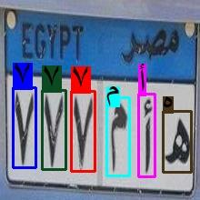

# Egyptian Car Plate OCR
 Developed as part of a Smart Parking System, this project includes a model for recognizing characters on Egyptian car plates. It features an API to serve a React.js web app and a Streamlit app for real-time analysis of images and videos.

 ## Inference on Image
  

## Inference on Video
https://github.com/alyalsayed/Graduation_Project/assets/84514495/6639b0e8-aa42-4229-8516-bfc4b6f00b24

