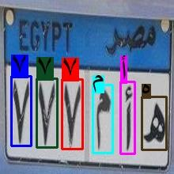

# Egyptian Car Plate OCR

An end-to-end solution for automatic recognition of Egyptian car plates, developed for Smart Parking Systems. This project features a deep learning model for character recognition, a REST API, a React.js web app, and a Streamlit interface for real-time analysis of images and videos.

## Table of Contents
- [Project Overview](#project-overview)
- [Features](#features)
- [Demo](#demo)
- [Installation](#installation)
- [Usage](#usage)
- [Web App](#web-app)
- [API](#api)
- [Streamlit App](#streamlit-app)
- [Model Details](#model-details)
- [Project Structure](#project-structure)
- [Contributing](#contributing)
- [License](#license)
- [Acknowledgements](#acknowledgements)

## Project Overview
This project automates the detection and recognition of Egyptian car plates using state-of-the-art deep learning models. Designed as part of a Smart Parking System, it supports image and video input and exposes an API which powers both a React.js web frontend and a Streamlit-based real-time dashboard.

## Features
- Accurate detection and OCR of Egyptian car plates in images and videos.
- RESTful API built with Flask for integration with other systems.
- Modern React.js web application for easy user interaction.
- Streamlit app for real-time, interactive analysis.
- Supports both Arabic and numeric plate characters.
- Easily extensible and modular codebase.

## Demo
 ## Inference on Image
  

### Inference on Video
https://github.com/alyalsayed/Graduation_Project/assets/84514495/6639b0e8-aa42-4229-8516-bfc4b6f00b24

### Full Demo
https://github.com/user-attachments/assets/7737453a-52a6-48d9-9281-469ea0ae59df

## Installation

### Prerequisites
- Python 3.8+
- Node.js & npm (for frontend)
- pip (Python package manager)
- (Optional) CUDA-enabled GPU for faster inference

### Clone the Repository
```bash
git clone https://github.com/alyalsayed/Graduation_Project.git
cd Graduation_Project
```

### Setup Backend (API)
```bash
cd api
pip install -r requirements.txt
# Or, if no requirements.txt, list major dependencies:
pip install flask flask-cors ultralytics opencv-python pillow numpy pandas arabic-reshaper python-bidi
```

### Setup Frontend
```bash
cd ../frontend
npm install
```

### Setup Streamlit App
```bash
cd ../streamlit
pip install -r requirements.txt
```

## Usage

### Web App
```bash
cd frontend
npm start
# Visit http://localhost:3000
```

### API
```bash
cd api
python server.py
# API will be available at http://localhost:5000
```

#### Example API Request
```bash
curl -X POST -F "image=@path_to_image.jpg" http://localhost:5000/predict
```

### Streamlit App
```bash
cd streamlit
streamlit run app.py
# Access via http://localhost:8501
```

## Model Details
- **Plate Detection**: YOLOv9, trained and exported to ONNX.
- **Character Recognition**: Custom CNN, supports both Arabic and numerical characters and another version with YOLOv9
- Models are located in the `models/` directory.

## Project Structure
```
Graduation_Project/
├── api/               # Flask API server
├── frontend/          # React.js web application
├── streamlit/         # Streamlit dashboard
├── training/          # Notebooks used for training
├── testing/           # Scripts for batch inference and evaluation and final results
├── utils/             # Utility modules (e.g., for drawing, video processing)
├── models/            # Pretrained model files (.onnx, etc.)
├── requirements.txt   # Python dependencies
└── README.md
```

## Contributing
1. Fork the repository.
2. Create your feature branch (`git checkout -b feature/feature-name`).
3. Commit your changes (`git commit -am 'Add new feature'`).
4. Push to the branch (`git push origin feature/feature-name`).
5. Open a Pull Request.

For major changes, please open an issue first to discuss what you would like to change.

## License
This project is licensed under the MIT License.

## Acknowledgements
- YOLO by Ultralytics
- Streamlit
- Create React App
- Thanks to the contributors and open-source community!
