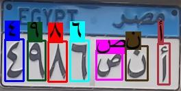

# Egyptian Car Plate OCR
 Developed as part of a Smart Parking System, this project includes a model for recognizing characters on Egyptian car plates. It features an API to serve a React.js web app and a Streamlit app for real-time analysis of images and videos.

 # Demo
 ## Inference on Image
  

## Inference on Video
 <video controls autoplay loop
 src="./streamlit/static/processed_videos/processed_video.mp4">
    
</video>